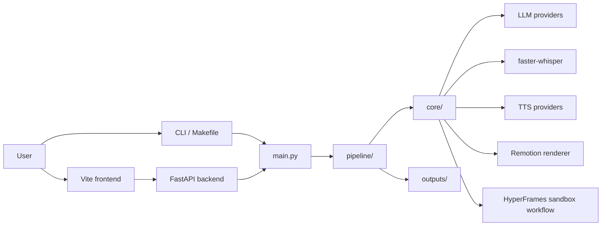
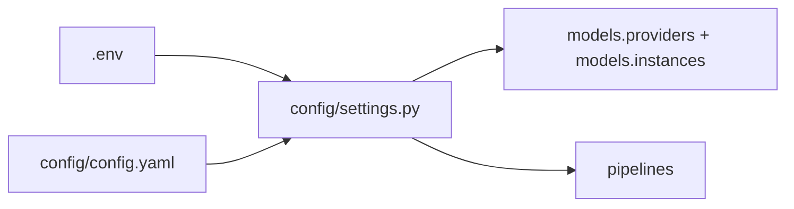

# Architecture

[English](ARCHITECTURE.md) | [中文](ARCHITECTURE.zh-CN.md)

## Overview

## Main Parts

- `main.py`: CLI commands and backend command handlers
- `api/`: FastAPI routes, job APIs, and request schemas
- `fronted/`: Vite frontend
- `pipeline/`: end-to-end production workflows
- `core/`: model providers, planners, renderers, prompts, sandbox tools
- `remotion/`: Remotion project and templates
- `config/`: YAML settings and environment variable loading
- `outputs/`: generated scripts, plans, media, subtitles, and rendered files

## Video Workflows

- Remotion: script -> scene plan -> Remotion input -> render
- `sketch_course`: script -> sketch-style course plan -> mobile-friendly Remotion render
- HyperFrames: script -> sandbox files -> optional preview -> optional render

## Configuration Flow

`models.providers` defines available model endpoints. `models.instances` maps each task to a provider and model.
