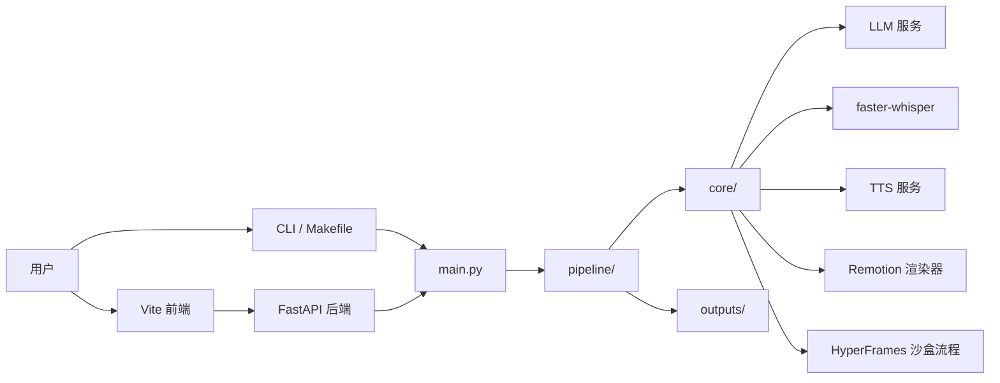
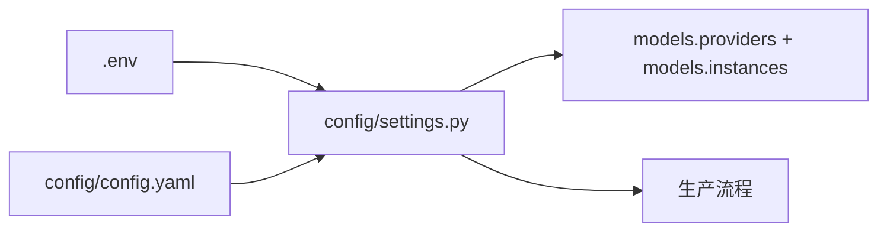

# 架构

[English](ARCHITECTURE.md) | [中文](ARCHITECTURE.zh-CN.md)

## 总览

## 主要模块

- `main.py`：CLI 命令和后端任务入口
- `api/`：FastAPI 路由、任务接口和请求结构
- `fronted/`：Vite 前端
- `pipeline/`：端到端生产流程
- `core/`：模型服务、规划器、渲染器、提示词和沙盒工具
- `remotion/`：Remotion 工程和模板
- `config/`：YAML 配置和环境变量加载
- `outputs/`：生成的脚本、计划、媒体、字幕和渲染文件

## 视频流程

- Remotion：脚本 -> 场景计划 -> Remotion 输入 -> 渲染
- `sketch_course`：脚本 -> 手绘课程风格计划 -> 手机友好的 Remotion 渲染
- HyperFrames：脚本 -> 沙盒文件 -> 可选预览 -> 可选渲染

## 配置流

`models.providers` 定义可用模型接口。`models.instances` 指定每个任务使用哪个服务和模型。

## Docker 镜像

- `backend`：默认 CPU 后端镜像
- `backend-cpu`：显式 CPU 后端 target
- `backend-cuda`：给 NVIDIA GPU 主机使用的可选 CUDA 后端 target
- `frontend`：提供 Vite 构建产物的 Nginx 镜像

`docker-compose.yml` 启动 CPU 后端和前端。`docker-compose.cuda.yml` 会覆盖后端 target，并请求 GPU 访问权限。
