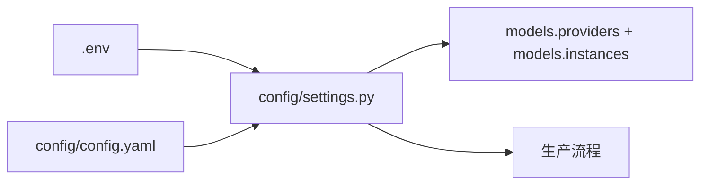

# 架构

[English](ARCHITECTURE.md) | [中文](ARCHITECTURE.zh-CN.md)

## 总览

## 主要模块

- `main.py`：CLI 命令和后端任务处理入口
- `api/`：FastAPI 路由、任务接口、请求结构
- `fronted/`：Vite 前端
- `pipeline/`：端到端生产流程
- `core/`：模型供应商、规划器、渲染器、提示词、沙盒工具
- `remotion/`：Remotion 工程和模板
- `config/`：YAML 配置和环境变量加载
- `outputs/`：生成的文案、计划、媒体、字幕和渲染文件

## 视频流程

- Remotion：文案 -> 场景计划 -> Remotion 输入 -> 渲染
- `sketch_course`：文案 -> 手绘课程风计划 -> 手机友好 Remotion 渲染
- HyperFrames：文案 -> 沙盒文件 -> 可选预览 -> 可选渲染

## 配置流

`models.providers` 定义可用模型接口。`models.instances` 指定每个任务使用哪个供应商和模型。
